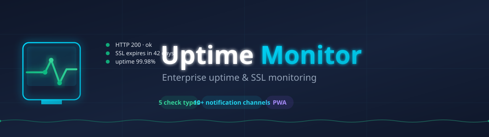
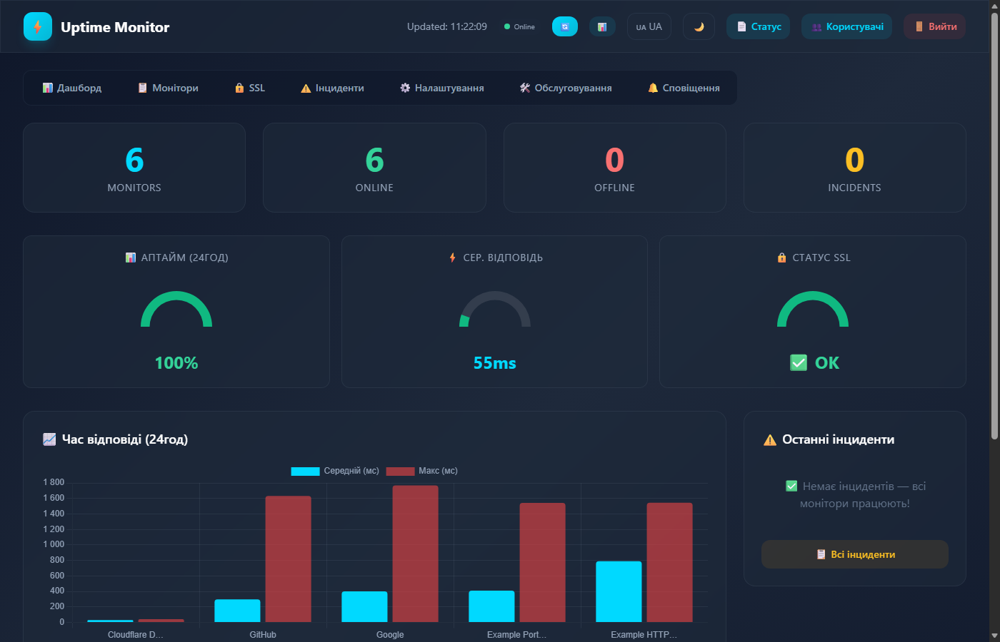
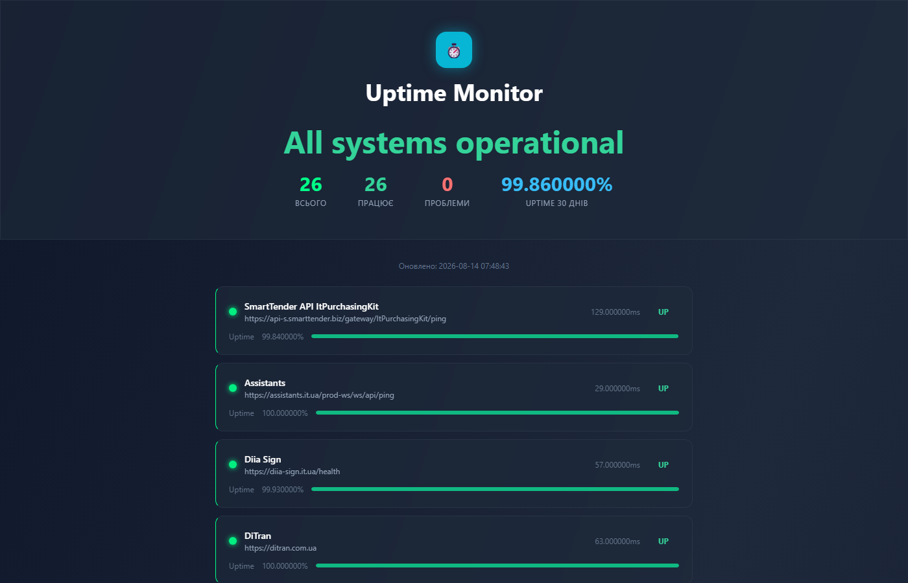
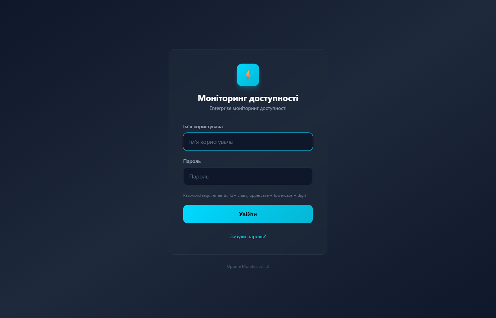

<div align="center">



# ⏱️ Uptime Monitor

**Enterprise uptime & SSL monitoring** — перевірка доступності сайтів, сервісів і SSL-сертифікатів з багатоканальними сповіщеннями, SLA-звітами та публічною сторінкою статусу.

[](https://go.dev)
[](https://github.com/ajjs1ajjs/Uptime-Monitor/releases)
[](https://github.com/ajjs1ajjs/Uptime-Monitor/releases)
[](https://github.com/ajjs1ajjs/Uptime-Monitor/actions)
[](LICENSE)

</div>

---

## ✨ Features

| | | |
|---|---|---|
| 🔍 **5 типів перевірок** | HTTP/HTTPS, TCP/Port, Ping, DNS та SSL — з інтервалами від 5 с | 
| 🔐 **SSL-моніторинг** | Контроль строку дії сертифікатів, пороги 30/14/7/5/3/1 день | 
| 📢 **10+ каналів сповіщень** | Telegram, Discord, Slack, MS Teams, Email/SMTP, SMS/Twilio, Webhook, Pushover, Gotify, ntfy | 
| 📊 **Публічна сторінка статусу** | `/status` без автентифікації, PWA — встановлюється на телефон | 
| 📈 **Інциденти та uptime %** | Історія перевірок і відсоток аптайму за будь-який період | 
| 📄 **SLA-звіти** | Експорт у JSON, CSV та HTML-PDF | 
| 🔒 **Безпека** | Ролі admin/viewer, API-ключі, CSRF, rate-limit, SSRF-guard | 
| 🗂️ **Обслуговування** | Maintenance windows, бекапи та відновлення БД | 

## 🖼️ Screenshots

| Дашборд | Публічна сторінка статусу |
|---|---|
|  |  |

| Вхід | |
|---|---|
|  | |

> Дашборд зображено з демо-даними; `/status` — з робочої інсталяції.

## 🚀 Швидкий старт

**Ubuntu / Debian** (одна команда і встановлює, і оновлює):
```bash
curl -sSL https://raw.githubusercontent.com/ajjs1ajjs/Uptime-Monitor/main/install.sh | sudo bash
```

**Windows 10/11 & Server 2016+** (PowerShell від імені адміністратора, також встановлює й оновлює):
```powershell
irm https://raw.githubusercontent.com/ajjs1ajjs/Uptime-Monitor/main/install.ps1 | iex
```
Або з параметрами:
```powershell
.\install.ps1 [-Version v1.2.3] [-SkipChecksum] [-AdminPassword 'YourPass']
```

> **Одна команда** і встановлює, і оновлює. При оновленні зберігаються конфіг, БД, користувачі та паролі; замінюється лише бінарник (попередній лишається як `.old`). Бінарники доступні для Linux (amd64/arm64), Windows (amd64/arm64) та macOS (amd64/arm64).

### 🐳 Docker

```bash
docker compose up -d
curl http://localhost:8080/health
```

### 🛠️ З сирців

```bash
go build -o uptime-monitor ./cmd/uptime-monitor
./uptime-monitor server --port 8080
```

### 🗝️ Перший вхід

При **першому** встановленні скрипт друкує логін/пароль прямо у висновку:

```
====================================
  Логін:    admin
  Пароль:   <згенерований>
====================================
```

- Пароль також зберігається одноразово у `/var/lib/uptime-monitor/admin_password.txt`
- При вході система **попросить змінити пароль** перед використанням

**Втратили пароль:**
```bash
sudo UPTIME_MONITOR_ADMIN_PASSWORD='YourStrongPass123' /opt/uptime-monitor/uptime-monitor reset-admin --config /etc/uptime-monitor/config.json
sudo systemctl restart uptime-monitor
```

## 🧪 Типи перевірок

| Тип | Що перевіряє | Приклад |
|---|---|---|
| `http` / `https` | Відповідь сервера, статус-код, ключове слово | `https://example.com` |
| `port` / `tcp` | Доступність TCP-порту | `example.com:443` |
| `ping` | ICMP-відповідь | `1.1.1.1` |
| `dns` | Резолвінг DNS | `google.com` |
| `ssl` | Строк дії сертифіката | `https://example.com` |

## 📢 Сповіщення

**Telegram · Discord · Slack · MS Teams · Email/SMTP · SMS/Twilio · Webhook · Pushover · Gotify · ntfy**

Кожен канал налаштовується через дашборд; секрети каналів шифруються (AES-GCM).

## 🔧 Команди

```bash
sudo systemctl start|stop|restart|status uptime-monitor   # Linux

# Windows
Start-Service|Stop-Service|Restart-Service uptime-monitor
Get-Service uptime-monitor

# Оновлення = та сама команда встановлення
curl -sSL https://raw.githubusercontent.com/ajjs1ajjs/Uptime-Monitor/main/install.sh | sudo bash

# Службові
uptime-monitor server [--port 8080] [--config PATH]
uptime-monitor reset-admin [--config PATH]
uptime-monitor has-admin [--config PATH]
uptime-monitor restore --backup FILENAME
```

## ⚙️ Конфігурація

Конфіг — у `config.json` (Linux: `/etc/uptime-monitor/config.json`):

```json
{
  "server": { "port": 8080, "host": "0.0.0.0" },
  "data_dir": "/var/lib/uptime-monitor",
  "log_dir": "/var/log/uptime-monitor",
  "check_interval": 60,
  "alert_policy": {
    "request_timeout_seconds": 30,
    "grace_period_seconds": 0,
    "up_success_threshold": 2,
    "still_down_repeat_seconds": 600,
    "treat_4xx_as_down": true,
    "verify_ssl": true,
    "ssl_notification_days": [30, 14, 7, 5, 3, 1],
    "ssl_check_interval_hours": 6
  }
}
```

## 🔒 Безпека

- **Пароль адміна** генерується при першій інсталяції і показується лише раз; зберігається bcrypt-хеш
- **Ролі**: viewer — тільки читання; admin — керування
- **CSRF**: same-origin перевірка для cookie-авторизованих змін API; API-ключі звільнені
- **Rate-limit**: логін 5/15хв, публічна сторінка 30/60с
- **SSRF-guard** при створенні сайтів (заборона loopback/link-local/metadata)
- **Секрети** каналів сповіщень шифруються (AES-GCM, ключ `master.key` поруч із конфігом)

## 🧩 Технології

**Бекенд:** Go 1.26.6 · net/http · SQLite (WAL, modernc.org/sqlite) · gorilla/websocket · pongo2 (Jinja2-шаблони) · golang.org/x/crypto

**Фронтенд:** Vanilla JS · Tailwind · PWA · WebSocket (embedded через `go:embed`)

## 📁 Структура

```
cmd/uptime-monitor      # CLI: server, reset-admin, has-admin, restore
internal/api            # HTTP API, middleware, WebSocket, UI-шаблони
internal/auth           # bcrypt, сесії, API-ключі, rate-limit
internal/config         # конфігурація сервера
internal/monitor        # воркер перевірок (http/tcp/ping/dns/ssl)
internal/netguard       # захист від SSRF/DNS-rebinding
internal/notify         # канали сповіщень (10+)
internal/storage        # SQLite: сайти, історія, сесії, аудит
```

## 📄 Ліцензія

[MIT](LICENSE) © ajjs1ajjs
